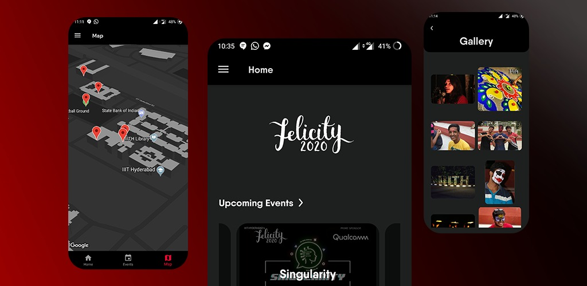

# Felicity'20

Felicity 2020 native app.


## Getting Started

This project is a a Flutter application.

A few resources to get you started if this is your first Flutter project:

- [Lab: Write your first Flutter app](https://flutter.dev/docs/get-started/codelab)
- [Cookbook: Useful Flutter samples](https://flutter.dev/docs/cookbook)

For help getting started with Flutter, view our
[online documentation](https://flutter.dev/docs), which offers tutorials,
samples, guidance on mobile development, and a full API reference.

## About the App

This app was made for Felicity'20. The app gives user details about the fest and what's going on right now. The app uses firebase services like firestore, storage and user authentication.

## How to run

1. The app requires the user to sign in to google services. So you need to download a google-services.json file from your firebase project and place it inside ```<app directory>/android/app>```.
2. To run the app in debug mode, run ```flutter run```
3. To run the app in release mode, run ```flutter run --release```
4. To build an apk, run ```flutter build apk```. Then to install it, run ```flutter install```. 
(Make sure you have a connected device for the above steps) 